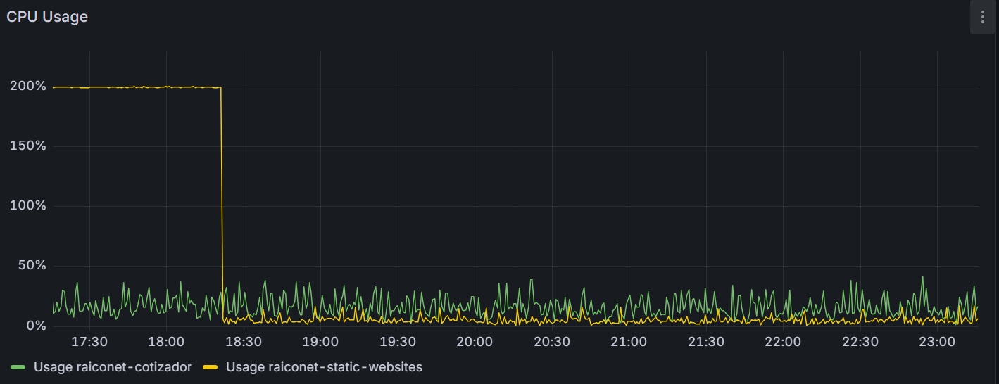

Recientemente se dio a conocer una cadena de vulnerabilidades alrededor de React Server Components (RSC) y su protocolo Flight. La primera fue la crítica y muy comentada **React2Shell (CVE-2025-55182)**: ejecución de código remoto (RCE) sin autenticación con un solo request, explotando deserialización insegura.

A partir de ese parche, investigadores siguieron hurgando (como siempre pasa) y aparecieron otras dos vulnerabilidades adicionales en el mismo ecosistema RSC:

- **CVE-2025-55184 / CVE-2025-67779**: **Denial of Service** (DoS) por payloads que pueden colgar el proceso.
- **CVE-2025-55183**: **Source Code Exposure**, donde un request malicioso puede hacer que una Server Function devuelva **código compilado** de otras Server Functions.

En palabras del equipo de Vercel:

> Una solicitud HTTP diseñada específicamente puede hacer que una Función del Servidor devuelva el código fuente compilado de otras Funciones del Servidor de tu aplicación. Esto podría revelar la lógica de negocio. **También podrían quedar expuestos secretos si se definen directamente en tu código** (en lugar de acceder a ellos mediante variables de entorno en tiempo de ejecución) y se referencian dentro de una Función del Servidor. **Dependiendo de la configuración de tu empaquetador (bundler), estos valores podrían quedar incrustados (inlined)** en la salida compilada de la función.

Fuente: https://nextjs.org/blog/security-update-2025-12-11 (CVE-2025-55183)

## Lo que nos pasó (y qué NO nos pasó)

Nosotros usamos **RSC y Server Functions** en Next.js. En los logs vimos peticiones claramente maliciosas intentando ejecutar el comportamiento descrito arriba, y efectivamente **se filtraron secretos**.

Sin embargo, aunque suene como leyeron nuestros secretos directamente en tiempo de ejecución, hay un detalle técnico importante:

- **No fue “lectura de variables de entorno en tiempo de ejecución”** (tipo `process.env.SECRET_XYZ`).
- Fue peor en otro sentido: algunos secrets que originalmente venían de un `.env` terminaron **inyectados por el bundler** (Turbopack) y quedaron **literalmente quemados** en el código compilado de la Server Function.

En otras palabras: para el atacante no eran “variables de entorno”. Eran **secretos quemados en el JavaScript transpilado**. Y con **CVE-2025-55183** ese output puede terminar en una respuesta HTTP.

## El “viejo truco”, versión 2025

La industria insiste en redescubrir los mismos incendios con nombres nuevos (¿Se acuerdan de Log4Shell y de los CVEs “aftershocks”?). ¿Esto es culpa de JavaScript? No necesariamente. Esto pasa en todos lados. Pero los frameworks FullStack JS están empujando una complejidad y mágia que abstraen responsabilidades de los desarrolladores: SSR, RSC, Server Actions, y encima ahora también protocolos nuevos (Flight). La superficie de ataque crece y la probabilidad de cometer errores de diseño o implementación también.

## Y como si fuera poco: DoS por CPU al 200%

Además de la filtración de secretos, nuestra web estuvo afectada no disponible por un tiempo: el servidor se nos fue a ~200% de CPU durante varios minutos. No fue un pico normal de tráfico: fue CPU clavada, como si el proceso hubiese quedado en un loop.

Esto es exactamente el tipo de síntoma que describe el DoS de RSC (**CVE-2025-55184**, y el fix completo **CVE-2025-67779**): un request malicioso puede desencadenar un estado de “hang” durante la deserialización del payload y dejar al proceso quemando CPU.

Lo más revelador e indicativo del origen de este problema: la CPU volvió a la normalidad justo cuando desplegué la actualización de Next.js con los parches. No es una prueba forense perfecta, pero es un patrón demasiado alineado con la descripción de los CVEs como para ignorarlo.



## Por qué “no root” nos ayudó (pero no nos salvó del todo)

En nuestro caso, tuvimos suerte de no correr el proceso como usuario con privilegios totales:

```Dockerfile
RUN addgroup --system --gid 1001 nodejs
RUN adduser --system --uid 1001 nextjs

COPY --from=builder /app/public ./public

# Set the correct permission for prerender cache
RUN mkdir .next
RUN chown nextjs:nodejs .next

# Automatically leverage output traces to reduce image size
# https://nextjs.org/docs/advanced-features/output-file-tracing
COPY --from=builder --chown=nextjs:nodejs /app/.next/standalone ./
COPY --from=builder --chown=nextjs:nodejs /app/.next/static ./.next/static

USER nextjs
```

Eso reduce impacto si un atacante logra llegar a una ejecución de código (y limita daños colaterales), pero si logra ejecutar código dentro del proceso Node, igual puede leer el `process.env` del proceso y cualquier archivo al que ese usuario tenga acceso.
Por lo menos no usaron nuestro servidor para minar criptomonedas.

## La tarde que nadie quiere tener

No detectamos ejecución de comandos en el host/contenerdor (no vimos comportamiento post-explotación tipo descargas, shells, etc.). Pero sí vimos exfiltración suficiente como para tratarlo como incidente:

- invalidar y rotar API keys
- rotar credenciales y tokens
- actualizar Next.js a una versión corregida
- auditar cómo estamos manejando secretos para que no queden quemados por el bundler

## Conclusión

Cada vez más convencido de que RSC fue un error y que el estado del arte de los Frameworks FullStack Javascript están en un callejón sin salida. Volvamos a lo explicito, rechamos las abstracciones y exijamos menos magia. Larga vida a las SPAs + REST, o MPAs tradicionales

